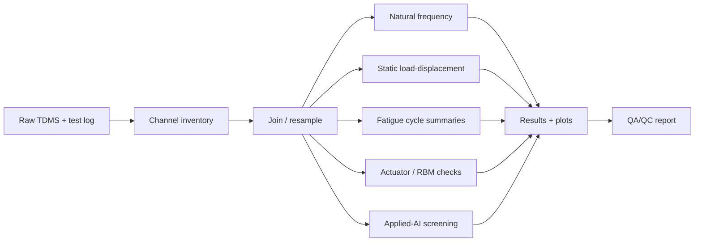
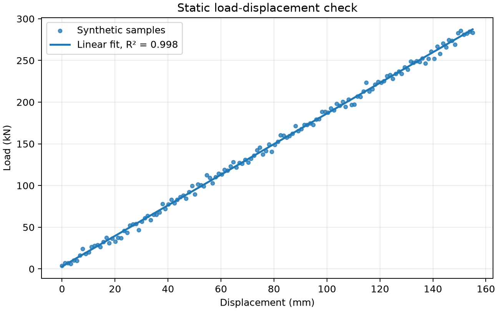
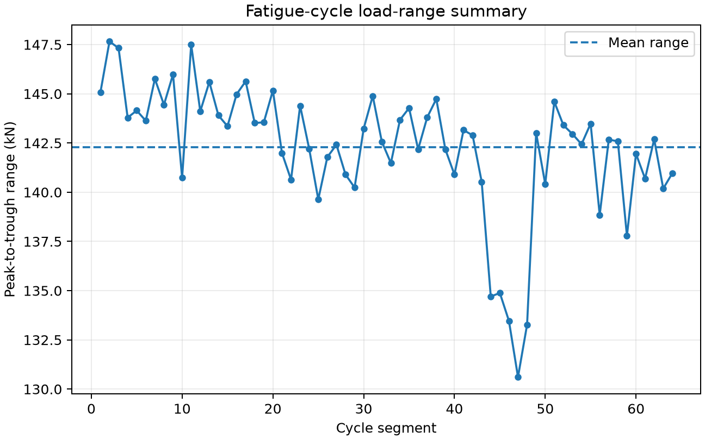
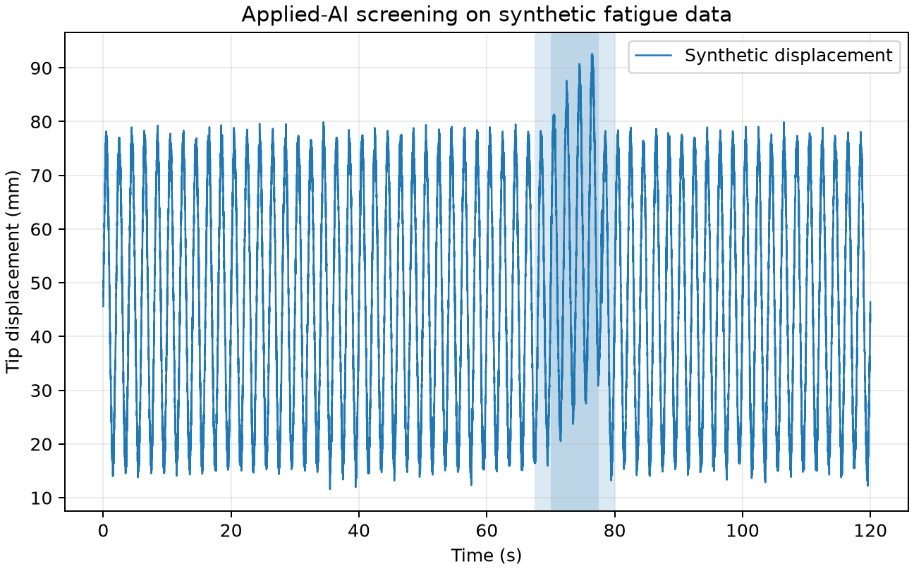

# Tidal Blade Test Analysis

**Research-software workflows for full-scale composite tidal blade structural-test data**

[](https://www.python.org/)
[](.github/workflows/ci.yml)
[](docs/research_software_card.md)
[](LICENSE)

Python utilities, examples, and documentation for processing full-scale tidal blade structural-test data.

The public repository is designed to show the analysis workflow without exposing private TDMS files, test logs, DIC images, or large generated result folders.

---

## Scope

This repository focuses on reusable analysis tasks from full-scale composite tidal blade testing:

- TDMS channel inspection and summarisation;
- static load-displacement processing;
- fatigue-cycle peak/trough summaries;
- natural-frequency and damping helpers;
- actuator-load and root-bending-moment checks;
- single-actuator and multi-actuator test comparison;
- lightweight applied-AI screening for long sensor time series.

The main public scope is the analysis context of the first FastBlade / LoadTide full-scale fatigue test and the later single-vs-multi-actuator comparison study. Later clamping/load-introduction and destructive-testing studies are listed as related FastBlade work, but this repository does **not** currently claim to reproduce their DIC, clamping, or failure-analysis workflows.

## What this is not

This is not a replacement for the private experimental data archive. Raw TDMS files, Excel logs, DIC images, and generated result folders are intentionally ignored by Git. The repository provides a public software layer: code, documentation, synthetic tests, configuration examples, and small public demos.

---

## Visual workflow



---

## Example outputs

Synthetic examples are included so the workflow can be demonstrated without publishing private experimental files.

| Static response | Fatigue-cycle summary | Applied-AI screening |
|---|---|---|
|  |  |  |

Regenerate the figures with:

```bash
python examples/generate_readme_figures.py
```

---

## Repository contents

| Area | Contents |
|---|---|
| `src/tidal_blade_test_analysis/` | Tested Python utilities and CLI commands |
| `tests/` | Pytest tests using synthetic public data |
| `examples/` | Configuration templates and synthetic examples |
| `docs/` | Publications, test configurations, workflow guide, software card, data dictionary, and applied-AI notes |
| `data/` | Local data layout description; raw data ignored by Git |

---

## Quick start

### Conda users

```bash
conda create -n tidal-blade-test python=3.10
conda activate tidal-blade-test
python -m pip install --upgrade pip
python -m pip install -e ".[dev]"
python -m pytest
```

### Windows PowerShell

```powershell
python -m venv .venv
.\.venv\Scripts\Activate.ps1
python -m pip install --upgrade pip
python -m pip install -e ".[dev]"
python -m pytest
```

### macOS/Linux

```bash
python -m venv .venv
source .venv/bin/activate
python -m pip install --upgrade pip
python -m pip install -e ".[dev]"
python -m pytest
```

---

## Command-line examples

Create local data folders:

```bash
tidal-blade-test init --root .
```

Summarise channels from a TDMS file or folder:

```bash
tidal-blade-test summarise data/raw --output data/results/channel_summary.csv
```

Find dominant frequencies from a CSV signal column:

```bash
tidal-blade-test fft data/processed/free_decay.csv --column load --sample-rate-hz 2500 --n-peaks 5
```

Fit a static load-displacement relationship:

```bash
tidal-blade-test static-fit data/processed/static_case.csv --load-column load --displacement-column displacement
```

Run the public synthetic examples:

```bash
python examples/synthetic_static_demo.py
python examples/synthetic_ml_anomaly_demo.py
```

---

## Applied AI / sensor QA screening

The repository includes a lightweight applied-AI layer for long structural-test time series. The purpose is to help prioritise engineering review, not to replace it.

Included tools:

- fixed-window feature extraction for actuator loads, displacement, strain, root bending moment, pressure, or other processed channels;
- fatigue-cycle response features based on turning points;
- robust drift scoring between a reference section and a candidate section;
- unsupervised anomaly screening using robust scaling and Isolation Forest.

The anomaly labels are **screening flags**, not confirmed damage labels. A flagged window should be checked against the raw signal, test log, actuator state, sensor health, environmental conditions, and engineering judgement.

Example:

```bash
python examples/synthetic_ml_anomaly_demo.py
```

See [`docs/applied_ai.md`](docs/applied_ai.md) for details.

---

## Configuration examples

The repository includes example YAML files for the core test configurations:

- `examples/config.single_actuator.yml`
- `examples/config.single_vs_multi_actuator.yml`
- `examples/config.example.yml`
- `examples/config.applied_ai_anomaly.yml`

These describe actuator count, actuator positions, target root bending moment, loading direction, analysis outputs, and screening inputs without exposing private data.

---

## Publications

See [`docs/publications.md`](docs/publications.md).

### Primary publications supported by the repository scope

1. *A Full-Scale Tidal Blade Fatigue Test using the FastBlade Facility*.
2. *A full-scale composite tidal blade fatigue test using single and multiple actuators*.

### Related FastBlade studies

1. *Clamping parameters in full-scale tidal turbine blade tests: A case study*.
2. *Destructive testing and failure analysis of a full-scale composite tidal turbine blade*.

---

## Development

```bash
python -m pip install -e ".[dev]"
python -m ruff check src tests
python -m pytest --cov=tidal_blade_test_analysis --cov-report=term-missing
```

---

## Citation

A `CITATION.cff` file is included so GitHub can generate citation text for the repository. The citation metadata also lists the primary and related FastBlade publications.

---

## License

MIT License. See [`LICENSE`](LICENSE).

---

## Author

Sergio Lopez-Dubon
