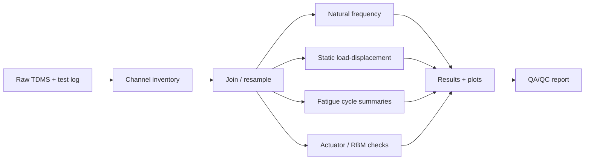

# Tidal Blade Test Analysis

**Research-software workflows for full-scale composite tidal blade structural-test data**

[](https://www.python.org/)
[](.github/workflows/ci.yml)
[](docs/research_software_card.md)
[](LICENSE)

---

## Scope

This repository contains Python workflows for processing and analysing full-scale composite tidal blade structural-test data, with emphasis on:

- TDMS channel inspection and summarisation;
- static load-displacement processing;
- fatigue-cycle peak/trough summaries;
- natural-frequency and damping helpers;
- actuator-load and root-bending-moment checks;
- single-actuator and multi-actuator test comparison;
- preservation of the original legacy scripts used during the analysis workflow.

The main public scope is the analysis context of the first FastBlade / LoadTide full-scale fatigue test and the later single-vs-multi-actuator comparison study. Later clamping/load-introduction and destructive-testing studies are listed as related FastBlade work, but this repository does **not** currently claim to reproduce their DIC, clamping, or failure-analysis workflows.

## What this is not

This is not a replacement for the private experimental data archive. Raw TDMS files, Excel logs, DIC images, and generated result folders are intentionally ignored by Git. The repository provides a public software layer: code, documentation, synthetic tests, configuration examples, and provenance notes.

---

## Visual workflow



---

## Repository contents

| Area | Contents |
|---|---|
| `src/tidal_blade_test_analysis/` | Tested Python utilities and CLI commands |
| `tests/` | Pytest tests using synthetic public data |
| `examples/` | Configuration templates and a small static-fit example |
| `docs/` | Publications, test configurations, workflow guide, software card, and legacy inventory |
| `legacy/original_code/` | Original uploaded scripts preserved for provenance |
| `legacy/code3_alternatives/` | Alternative versions from the second archive where they differed |
| `data/` | Local data layout description; raw data ignored by Git |

---

## Quick start

### Conda users

```bash
conda create -n tidal-blade-test python=3.10
conda activate tidal-blade-test
python -m pip install --upgrade pip
python -m pip install -e ".[dev]"
python -m pytest
```

### Windows PowerShell

```powershell
python -m venv .venv
.\.venv\Scripts\Activate.ps1
python -m pip install --upgrade pip
python -m pip install -e ".[dev]"
python -m pytest
```

### macOS/Linux

```bash
python -m venv .venv
source .venv/bin/activate
python -m pip install --upgrade pip
python -m pip install -e ".[dev]"
python -m pytest
```

---

## Command-line examples

Create local data folders:

```bash
tidal-blade-test init --root .
```

Summarise channels from a TDMS file or folder:

```bash
tidal-blade-test summarise data/raw --output data/results/channel_summary.csv
```

Find dominant frequencies from a CSV signal column:

```bash
tidal-blade-test fft data/processed/free_decay.csv --column load --sample-rate-hz 2500 --n-peaks 5
```

Fit a static load-displacement relationship:

```bash
tidal-blade-test static-fit data/processed/static_case.csv --load-column load --displacement-column displacement
```

Run the public synthetic example:

```bash
python examples/synthetic_static_demo.py
```

---

## Configuration examples

The repository includes example YAML files for the core test configurations:

- `examples/config.single_actuator.yml`
- `examples/config.single_vs_multi_actuator.yml`
- `examples/config.example.yml`

These describe actuator count, actuator positions, target root bending moment, loading direction, and analysis outputs without exposing private data.

---

## Publications

See [`docs/publications.md`](docs/publications.md).

### Primary publications supported by the repository scope

1. *A Full-Scale Tidal Blade Fatigue Test using the FastBlade Facility*.
2. *A full-scale composite tidal blade fatigue test using single and multiple actuators*.

### Related FastBlade studies

3. *Clamping parameters in full-scale tidal turbine blade tests: A case study*.
4. *Destructive testing and failure analysis of a full-scale composite tidal turbine blade*.

---

## Legacy-script migration plan

The original scripts are valuable because they encode the actual experiment logic. They also contain exploratory patterns that are fragile in a public repository: hard-coded local paths, duplicated analysis variants, immediate execution on import, and private data assumptions.

Recommended migration path:

1. Keep the scripts under `legacy/` as provenance.
2. Move repeated blocks into tested modules under `src/tidal_blade_test_analysis/`.
3. Replace hard-coded paths with command-line arguments or configuration files.
4. Add synthetic tests for each calculation before refactoring the full workflow.
5. Add small public examples, but keep raw TDMS data outside Git.

See [`docs/legacy_inventory.md`](docs/legacy_inventory.md) for the script-by-script inventory.

---

## Development

```bash
python -m pip install -e ".[dev]"
python -m ruff check src tests
python -m pytest --cov=tidal_blade_test_analysis --cov-report=term-missing
```

---

## Citation

A `CITATION.cff` file is included so GitHub can generate citation text for the repository. The citation metadata also lists the primary and related FastBlade publications.

---

## License

MIT License. See [`LICENSE`](LICENSE).

---

## Author

Sergio Lopez-Dubon
